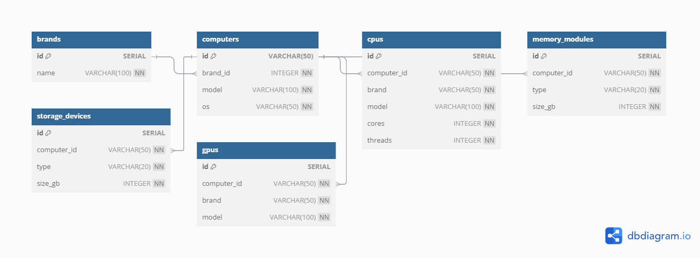

# Projeto: Modelagem e Normalização de Dados JSON de Computadores

Este projeto demonstra como transformar dados aninhados em JSON sobre computadores em um modelo relacional bem estruturado, utilizando boas práticas de modelagem e pipeline de dados em Python.

---

## 🔧 Tecnologias Utilizadas

- Python 3.10+
- PostgreSQL (via Docker)
- psycopg2
- Docker Compose

---

## 🎯 Objetivo

Ler dados estruturados em JSON com campos aninhados como CPU, memória, armazenamento e GPU, normalizar para um modelo relacional e armazenar os dados em um banco PostgreSQL.

---

## 🧱 Estrutura do Projeto

```
modelagem-dados-json/
│
├── data/                     # Contém o arquivo JSON com os dados brutos
│   └── raw_computers.json
│
├── db/                       # Schema SQL para criar tabelas
│   └── schema.sql
│
├── docker/                   # Configuração do banco com Docker
│   └── docker-compose.yml
│
├── etl/                      # Scripts de ETL
│   ├── extract.py
│   ├── transform.py
│   └── load.py
│
├── docs/
│   └── model.png             # Diagrama do modelo relacional
│
├── main.py                   # Pipeline principal
├── requirements.txt
└── README.md
```

---

## 🧠 Arquitetura e Decisões de Modelagem

Este projeto segue uma **arquitetura de dados relacional normalizada**, típica de sistemas OLTP. Aplicamos **3ª Forma Normal**, com:

- Extração da entidade `brands` para uma tabela separada (evitando redundância)
- Tabelas separadas para entidades aninhadas: `cpus`, `memory_modules`, `storage_devices`, `gpus`
- Chaves estrangeiras bem definidas
- Restrições `CHECK` para garantir qualidade dos dados (ex: `threads >= cores`)

---

## 📊 Modelo Relacional



---

## 🚀 Como Executar

### 1. Clone o repositório
```bash
git clone https://github.com/seu-usuario/modelagem-dados-json.git
cd modelagem-dados-json
```

### 2. Crie um ambiente virtual e ative
```bash
python -m venv venv
source venv/bin/activate  # ou venv\Scripts\activate no Windows
```

### 3. Instale as dependências
```bash
pip install -r requirements.txt
```

### 4. Suba o banco e rode o pipeline
```bash
python main.py
```

---

## 📂 Acesso ao Banco

Após rodar o projeto, você pode acessar os dados via ferramentas como DBeaver ou pgAdmin:

| Campo     | Valor        |
|-----------|--------------|
| Host      | localhost    |
| Porta     | 5432         |
| Banco     | computers_db |
| Usuário   | postgres     |
| Senha     | postgres     |

---

## 📌 Observações

- O projeto foi pensado para ser modular, com funções separadas para extração, transformação e carga (ETL).
- A modelagem foi feita considerando boas práticas de integridade, desempenho e legibilidade.
- A imagem `docs/model.png` representa a modelagem relacional gerada a partir dos dados JSON.

---
---

## 👤 Autor

Conecte-se comigo no [LinkedIn](https://www.linkedin.com/in/pedro-sofiati-de-sa/)
